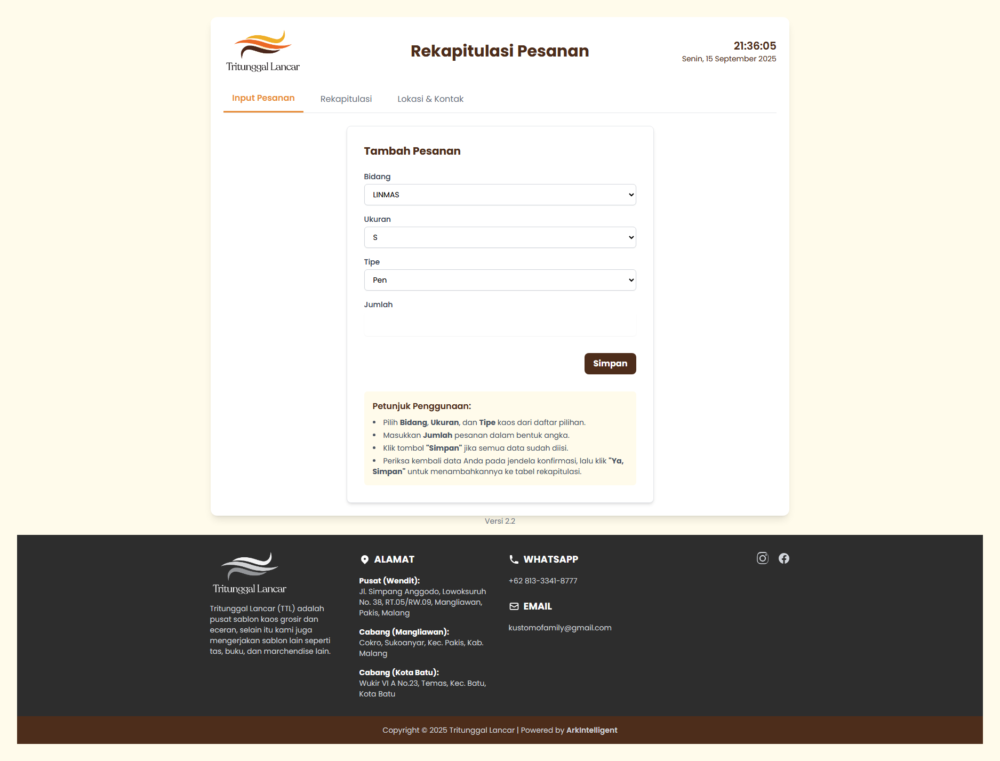
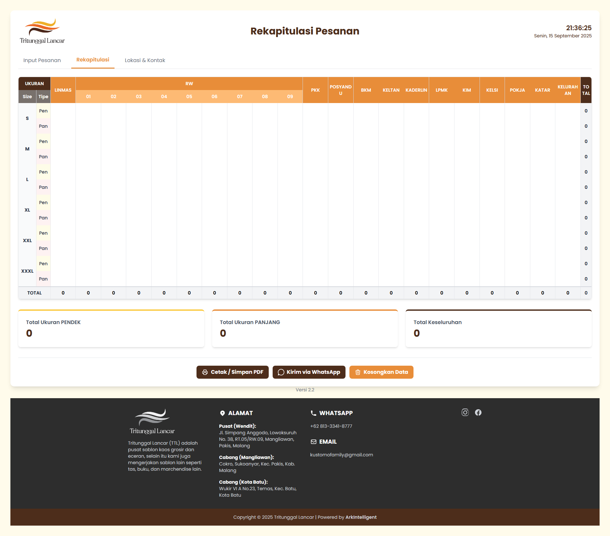
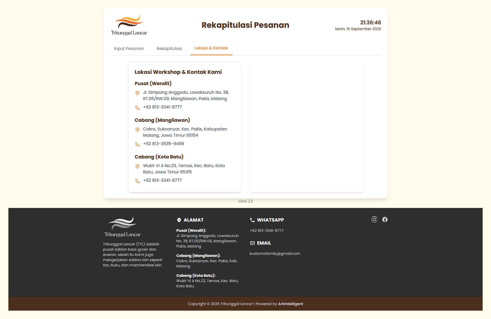

# Rekapitulasi Pesanan "Tritunggal Lancar"

Aplikasi web client-side yang dirancang untuk rekapitulasi dan kalkulasi pesanan kaos secara efisien.

---

## Tampilan Aplikasi

| Input Pesanan | Rekapitulasi Pesanan | Lokasi & Kontak |
| :---: | :---: | :---: |
|  |  |  |

---

## Deskripsi

Proyek ini adalah sebuah aplikasi web sederhana yang dibangun untuk membantu "Tritunggal Lancar" dalam mengelola, merekapitulasi, dan menghitung total pesanan kaos. Aplikasi ini berjalan sepenuhnya di sisi klien (*client-side*), artinya tidak memerlukan server backend atau database. Semua data disimpan secara lokal di browser pengguna, memastikan kecepatan dan kemudahan penggunaan.

---

## Fitur Utama

- 📝 **Input Data Fleksibel**: Memasukkan data pesanan baru melalui form yang intuitif dan mudah digunakan.
- 📊 **Tabel Rekapitulasi Dinamis**: Semua data ditampilkan dalam tabel interaktif yang dibuat secara otomatis oleh JavaScript.
- 🧮 **Kalkulasi Otomatis & Real-time**: Total pesanan per item, per bidang (kolom), dan total keseluruhan dihitung secara otomatis setiap kali ada perubahan data.
- 💾 **Penyimpanan Data Otomatis**: Aplikasi menggunakan `localStorage` browser untuk menyimpan semua data. Data tidak akan hilang meskipun Anda me-refresh atau menutup halaman.
- 📄 **Fungsi Cetak ke PDF**: Terdapat tombol "Cetak" yang menghasilkan tampilan siap cetak (atau disimpan sebagai PDF) yang rapi dan profesional.
- 📱 **Antarmuka Responsif**: Didesain menggunakan Tailwind CSS agar nyaman digunakan di berbagai ukuran layar, dari desktop hingga mobile.
- ℹ️ **Halaman Informasi**: Dilengkapi tab untuk menampilkan informasi lokasi workshop dan detail kontak perusahaan.
- 🕰️ **Jam & Tanggal Live**: Menampilkan waktu dan tanggal terkini di header untuk konteks.

---

## Teknologi yang Digunakan

- **HTML5**
- **CSS3** (dengan custom properties/variables untuk theming)
- **Tailwind CSS** (dimuat via CDN)
- **JavaScript (Vanilla JS)**: Digunakan untuk semua logika aplikasi, termasuk manipulasi DOM, kalkulasi, dan penyimpanan data.

---

## Struktur Folder

```

/
├── index.html       (File struktur utama HTML)
├── style.css        (File styling kustom untuk tema dan layout)
├── script.js        (File logika utama aplikasi)
├── logo-warna.png   (Aset gambar logo berwarna)
├── logo-bw.png      (Aset gambar logo hitam-putih)
├── input-pesanan.png (Screenshot halaman input)
├── rekap-pesanan.png (Screenshot halaman rekap)
└── lokasi-kontak.png (Screenshot halaman lokasi)

```

---

## Instalasi dan Penggunaan

Aplikasi ini tidak memerlukan proses instalasi atau *build tools* yang kompleks.

1.  Pastikan semua file (`index.html`, `style.css`, `script.js`, dan semua gambar) berada dalam satu folder yang sama.
2.  Cukup buka file **`index.html`** pada browser modern (seperti Google Chrome, Mozilla Firefox, Microsoft Edge).
3.  Aplikasi siap digunakan.

**Catatan:** Koneksi internet diperlukan saat pertama kali membuka halaman agar library Tailwind CSS dapat dimuat dari CDN.

---

## Cara Kerja Penyimpanan Data

Setiap perubahan yang Anda buat pada sel tabel akan secara otomatis disimpan ke **`localStorage`** browser Anda.
- Saat Anda membuka aplikasi, skrip akan memeriksa apakah ada data yang tersimpan di `localStorage`.
- Jika ada, data tersebut akan dimuat ke dalam tabel.
- Jika tidak ada (penggunaan pertama kali), tabel akan diisi dengan data awal (*initial data*) yang ada di dalam `script.js`.
- Mengklik tombol "Kosongkan Data" akan menghapus data dari tabel dan juga dari `localStorage`.

---

## Kredit

- Powered by **ArkIntelligent** ([https://github.com/fusionprojectid](https://github.com/fusionprojectid))
```
